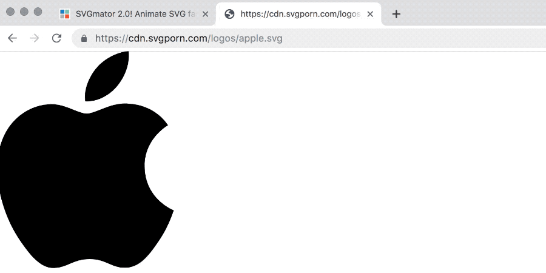

In my [recent toy](https://www.svgmator.com/), I had the need to load external files from within the browser, such as an SVG file hosted on a remote server, in order to inject them in the DOM for further manipulation.

It's a nice little UX add-on to avoid the user downloading a particular file and then to upload it on [SVGmator](https://www.svgmator.com/). Providing the URL, the software would be able to download and upload behind the scene on behalf of the user.



It's a simple task, but the security model of the browser prevents to fetch, via javascript, external text files that belong to different domains, thus, this simple script is not going to work out of the box:

```javascript
fetch('https://www.examples.com/myfile.svg')
```

## Welcome Lambda Functions

It these days it's quite common to find services that provide the so-called lambda functions. Briefly, they are (usually Node.js) scripts that can be invoked through an API call, performing a task and returning a result. You don't have to deal with their hosting and other server stuff (indeed they are part of the serverless movement!).

Back to my problem, here the code that accomplishes the mentioned requirement, using [Netlify Functions](https://www.netlify.com/docs/functions/) in this case (the Netlify version of the lambda thing).

The browser needs to make a POST request to the lambda, passing a parameter, such as:

```javascript
const req = await fetch('/.netlify/getsvg', {
  method:'POST',
  body: JSON.stringify({url: 'https://www.examples.com/myfile.svg'})
})
const res = await req.text()
```

The above code (it's ES6, it needs to be within an `async` function) will get a raw SVG code that can be eventually injected in the DOM.

The lambda function is a Node.js script that actually fetches the SVG and returns it as raw source:

```javascript
const axios = require('axios')

exports.handler = async (event, context) => {
  const body = JSON.parse(event.body)

  const res = await axios.get(body.url)

  return {
    statusCode: res.status,
    body: res.data
  }
}
```

That's approximately all. Please refer to the Netlify [documentation](https://www.netlify.com/docs/functions/) about how to use the service.

