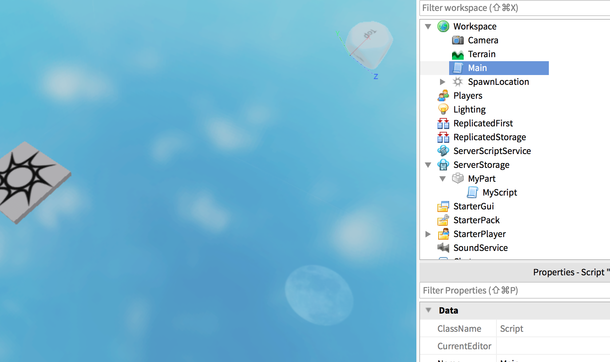
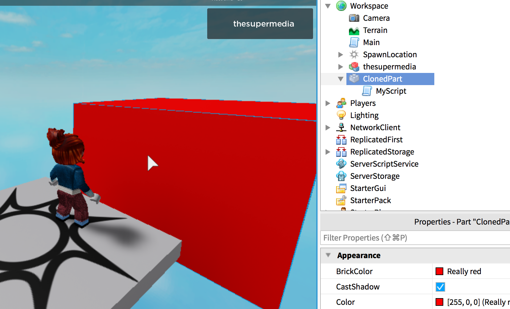

Cloning a Part is very interesting since you can also cloning its own attached script.

This opers interesting possibilities, such as make the Part always different.

Suppose you have a `MyPart` in `ServerStorage`:



And the `Main` script with:

```lua
local p = game.ServerStorage["MyPart"]:Clone()
p.Parent = game.Workspace
```

The Part is created when the game starts.

Now, add the following code in `MyScript`:

```lua
local p = script.Parent

local height = math.random(2, 100)

p.Size = Vector3.new(20, height, 20)
p.Position = Vector3.new(0, 0, -23)
p.Anchored = true
p.Name = "ClonedPart"
p.BrickColor = BrickColor.new(255,0,0)
```

You should see something like:



The Part has been created and modified at run-time.

Nothing stop us to add much more logic in `MyScript`, though.