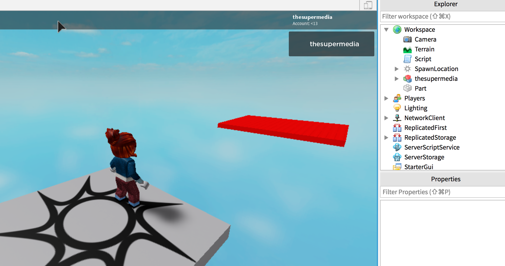

Creating elements in Roblox is quite straightforward. You need to instance the element you want and you can set its properties:

In the main script, add this code:

```lua
local p = Instance.new("Part", game.Workspace)
p.Size = Vector3.new(20, 1, 20)
p.Position = Vector3.new(0, 0, -50)
p.Anchored = true
p.BrickColor = BrickColor.new(255,0,0)
```

Adding `Anchored` is required if you don't have a Baseplate in your game. Here the result:

