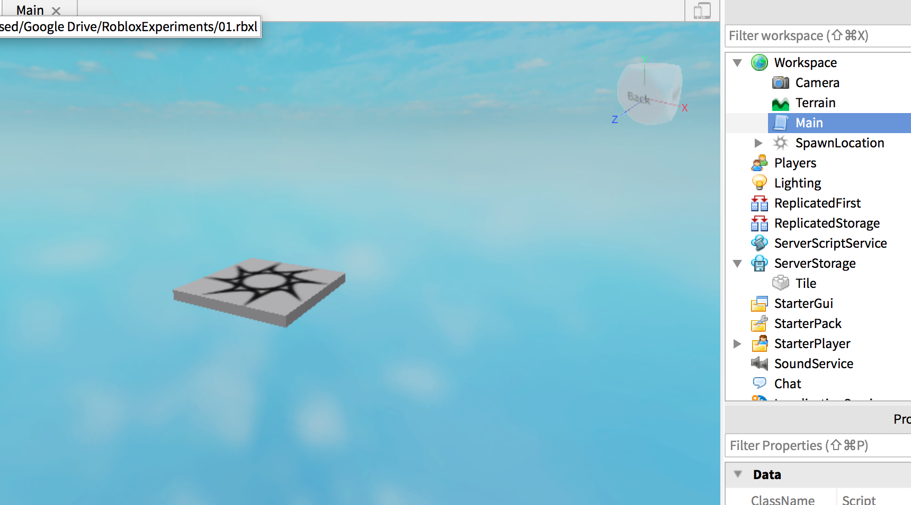
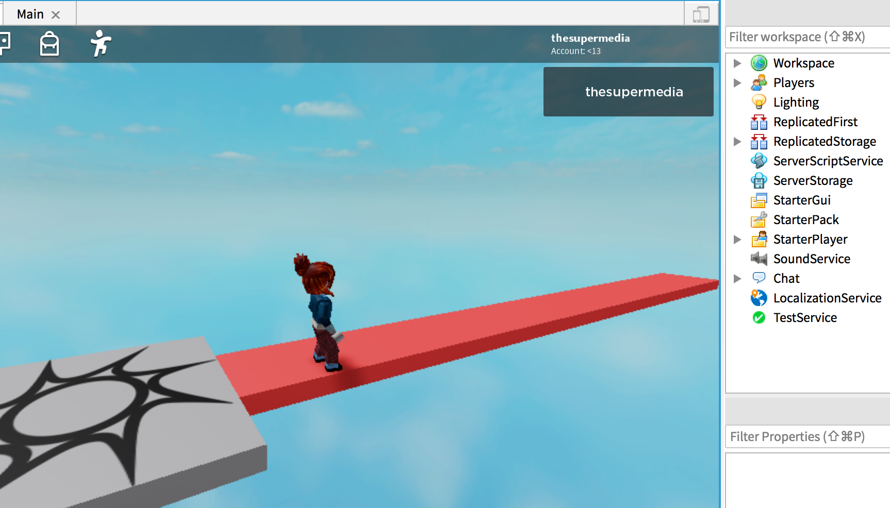

We know how to create a Part with script using the `Clone` function. This code create a Part that exists in ServerStorage, a Part with name `Tile`:

```lua
local p = game.ServerStorage.Tile:Clone()
p.Parent = game.Workspace
p.Position = Vector3.new(0,0,-10)
```

We can exploit the [for-loop](https://developer.roblox.com/en-us/articles/Loops) strategy to create many tiles. The following code create 6 tiles positioned along the `z` axis assuming their size is `5,1,5`

```lua
for count = 0, 10 do
	local p = game.ServerStorage.Tile:Clone()
	p.Parent = game.Workspace
	p.Position = Vector3.new(0,0,-8.5 - count*5)
end
```

The only difference is that we need to calculate the position for each, otherwise they'll be all on the same spot, that's useless.

Before running it:



After hit Run:

