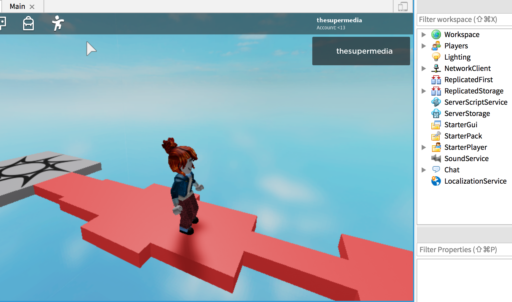

Here the code to generate a path made of tiles (Part) using a single Part that sits in the ServerStorage service:

```lua
for count = 0, 10 do
	local p = game.ServerStorage.Tile:Clone()
	p.Parent = game.Workspace
	p.Position = Vector3.new(0,0,-8.5 - count*5)
	
	-- math.random(2,10) return a number between 2 and 10
	p.Size = Vector3.new(math.random(2,10), 1, 5)
end
```

The particularity of this example is the use of [math.random](https://developer.roblox.com/en-us/api-reference/lua-docs/math) to shuffle the size of each tile in order to get something like:

