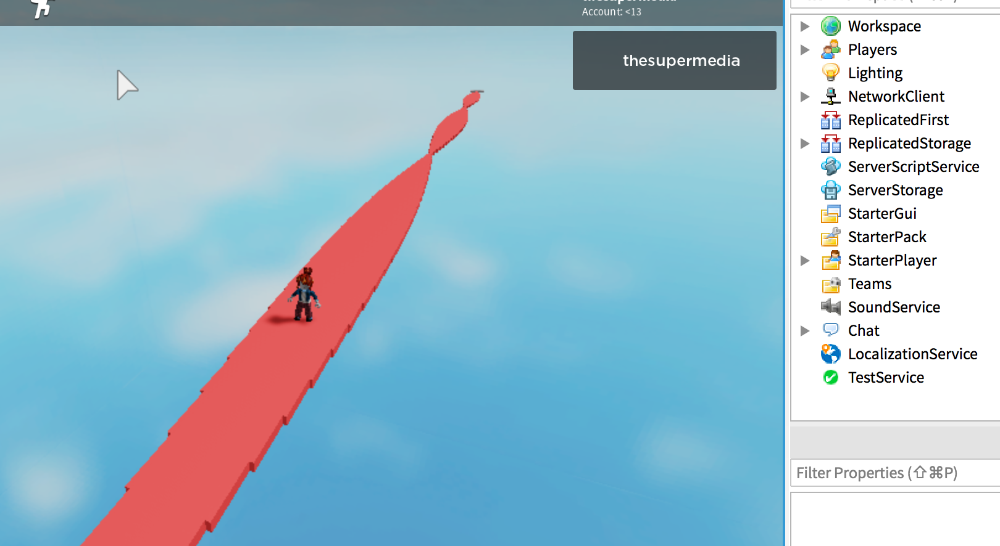

Creating a list of tiles (Part) and resize one dimension using [math.sin](https://developer.roblox.com/en-us/api-reference/lua-docs/math) to modulate armonically the shape of the path:



The script use a variable `a` that is incremented within the `for-loop`. A new `x` variable is calculated for each tile:

```lua
local a = 0

for count = 0, 100 do
	local p = game.ServerStorage.Tile:Clone()
	p.Parent = game.Workspace
	p.Position = Vector3.new(0,0,-8.5 - count*5)
	
	local x = math.abs(math.sin(a)*10) + 1
	p.Size = Vector3.new(x, 1, 5)
	a = a + 0.1
end

```

