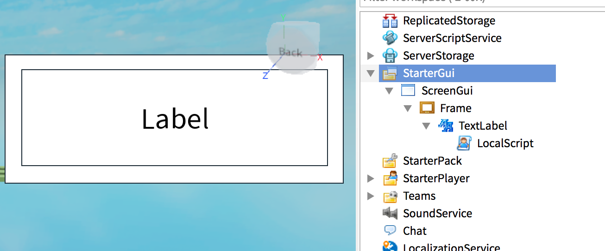

To create a billboard panel in Roblox you have to add it in the editor in the **StarterGui**, adding within:

- a ScreenGui
- a Frame
- a TextLabel
- a LocalScript

You should see something like:



You can configure properties and position of the panel using the Properties panel.

Then, add this code in the LocalScript:

```lua
print("Hello UI!")
script.Parent.Text = math.random(0,1000)
```

This script will be executed when the UI will be shown.