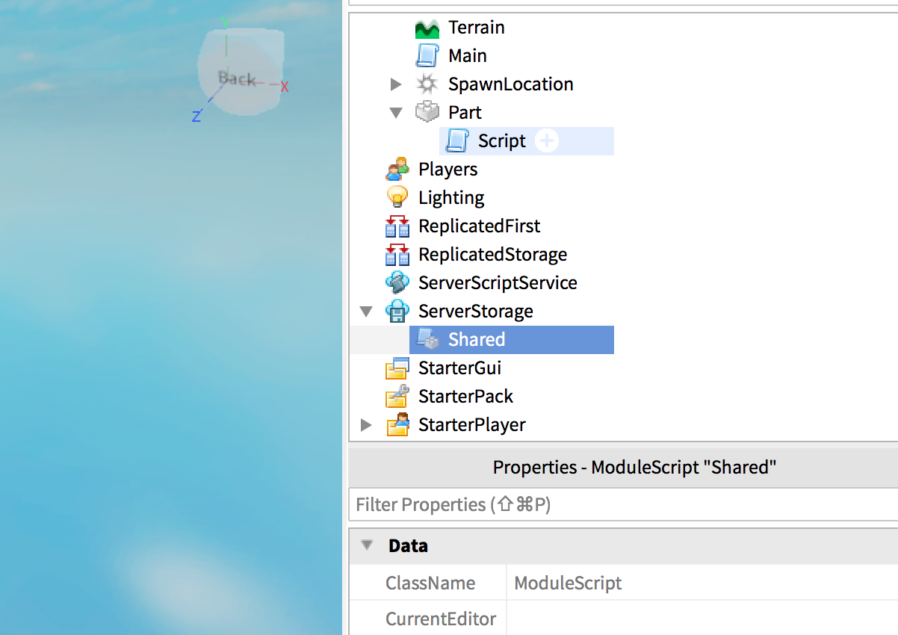

Sometimes you want to place many elements in the workplace using the editor giving to all of them the same script behaviour.

This is where **Module Script** comes in handy.

You need an object in the scene (Part or Model) with the following code attached:

```lua
require(game.ServerStorage.MyShared):DoSomething(script.Parent)
```

And in the `ServerStorage` a **Module Script** with this code:

```lua
local module = {}

function module:DoSomething(parent)
  print("HEY", parent)
end

return module
```

The above code just print a string when some object requires it.

This way you can edit the module one time and all the objects that reference to it will get the updates.

