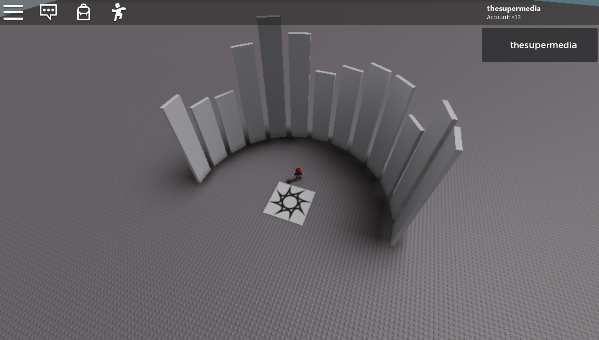

Here a bit of math and trigonometry to create on the fly a wall around a circle like that:



First thing first, you need to put a **Part** in **ServerStorage** with the name `Wall`, then run this code from a main script:

```lua
local a = 0
local add = math.pi / 12
local radius = 30

for count = 0, 12 do
	local p = game.ServerStorage.Wall:Clone()
	p.Parent = game.Workspace
	
	local x = math.cos(a) * radius
	local y = math.sin(a) * radius
	
	local h = 20 + math.random(20)
	
	p.Position = Vector3.new(x, h/2, y)
	p.Orientation = Vector3.new(0, a*180/math.pi*-1, 0)
	p.Size = Vector3.new(1, h, 6)
	
	p.Anchored = true
	
	a = a + add
end
```

Happy generation!