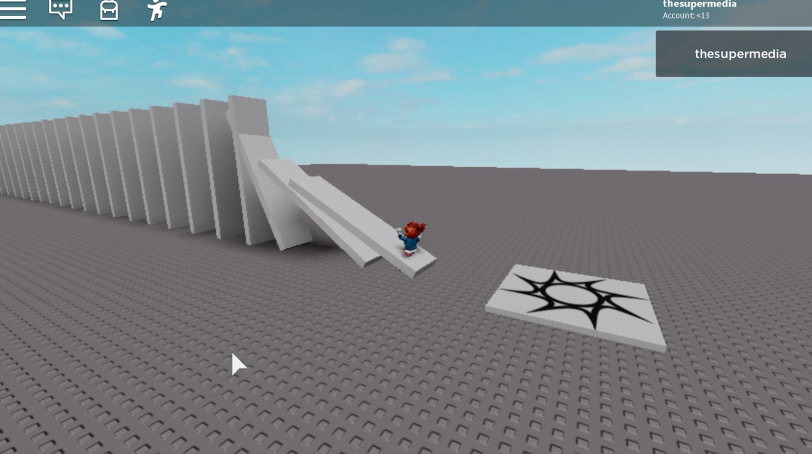

Here the code to create elements for a domino effect.



[Watch the preview.](https://www.youtube.com/watch?v=0k416xeuLOM)

Put a Part in the ServerStorage and name it `Wall`, then put in the main script this code:

```lua
for count = 0, 30 do
	local p = game.ServerStorage.Wall:Clone()
	p.Parent = game.Workspace
	
	local z = 7 * count * -1 - 20
	local h = 20
	
	p.Position = Vector3.new(0, h/2, z)
	p.Size = Vector3.new(5, h, 1)
	
end
```

Have fun!