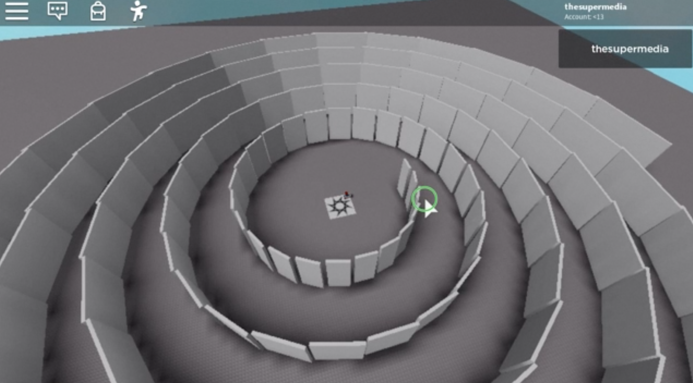

Want to generate a labyrinth following a spiral shape?



[Watch the preview.](https://www.youtube.com/watch?v=0k416xeuLOM)

Here the code to do that using a Part cloned multiple times:

```lua
local a = 0
local add = math.pi / 12
local radius = 30
local width = 6

for count = 0, 120 do
	local p = game.ServerStorage.Wall:Clone()
	p.Parent = game.Workspace
	
	local x = math.cos(a) * radius
	local y = math.sin(a) * radius
	
	local h = 20
	
	p.Position = Vector3.new(x, h/2, y)
	p.Orientation = Vector3.new(0, a*180/math.pi*-1, 0)
	p.Size = Vector3.new(1, h, width)
	
	p.Anchored = true
	
	radius = radius + 1
	width = width + 0.3
	
	a = a + add
end
```

