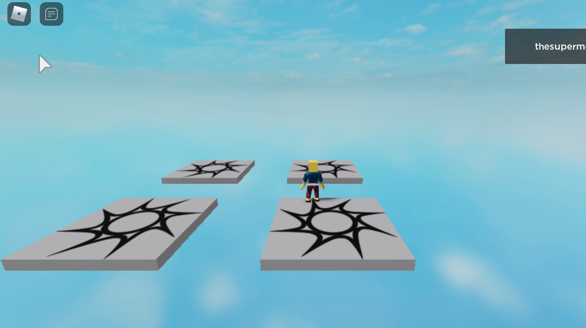

If you have many **SpawnLocation** in your game, each Player that comes in will be put on top of one of those **randomly**.

That opens interesting possibilities.

The nice part is that you can add many SpawnLocation using code:



First off, put a SpawnLocation into the ServerStorage and name it with `SL`, then put this code in the main script:

```lua
-- create a map of position for each SpawnLocation
local slPos = {}

slPos[0] = {10,10}
slPos[1] = {-10,10}
slPos[2] = {10,-10}
slPos[3] = {-10,-10}

-- clone the SL object and place them in the game
local count = 0

for Index, Value in pairs( slPos ) do
	local x = slPos[count][1]
	local y = slPos[count][2]
	count = count + 1
	
	local sl = game.ServerStorage.SL:Clone()
	
	sl.Parent = game.Workspace
	sl.Position = Vector3.new(x, 0, y)
	sl.Anchored = true
end
```

