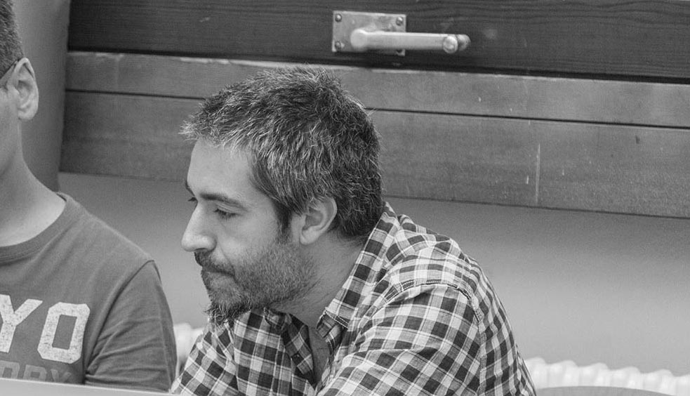

I was born forty-and-something years ago. I'm italian and I currently live in my (still) beautiful country. I'm a father of a *way-more-smarter-then-me* little girl.

I have more than fifteen years of **computational design** experience and extensive IT knowledge. I'm actually serving as **CTO** at [TODO](https://todo.to.it/), the design consultancy I've co-founded back in 2007. I'm happy enough to lead the design and development team from a vantage point at the crossroads of **design** and **coding**. I love exploring technologies and I'm passionate about internal processes optimization by means of Agile and innovative principles. I'm not satisfied by my actual knowledge, therefore, I constantly study something. I'm an ever learner person.

My approach stems from a deep-rooted interest in creative disciplines, ranging from music to design, from performing to generative arts. In 2008 I conceived CSTEM, the first event devoted to computational design practices in art and design in Italy. I'm also a keen educator always been involved in teaching and lecturing at several institutions and workshops. I currently hold teaching positions at SUPSI, Lugano (interaction design at [MAIND Master Program](https://www.maind.supsi.ch/)), [Big Dive](http://www.bigdive.eu/) training program, Turin (data visualization), and [European Institute of Design](http://www.ied.it/), Turin (interface design and prototyping).

I post updates on [Twitter](https://twitter.com/fabiofranchino), committing chunks of code on [Github](https://github.com/abusedmedia) and sometimes update professional info on [Linkedin](https://www.linkedin.com/in/abusedmedia/).

## Teaching

DesignToday is a little term I like to use to describe my way of thinking in creativity.

DesignToday courses is a way of thinking after 20 years of experience in the digital field both as pratictioner and mentor/teacher as well.

The following course have been crafted and refined over time and they are still in work in progress. I try to keep up-to-date their outline and syllabus whenever I introduce variation in my classes.

Here the current encoded courses you might want to look into:

- Creative coding with JS
- Sketching with HTML&CSS
- Data driven with d3.js
- Adventures in Data Visualization

## 

- head of technology
- problem solving with design thinking approach
- team leader
- interaction design
- creative coding
- front-end developer
- hybrid designer+developer
- UI+UX designer
- micro-interactions prototyper
- data visualization specialist
- tech and strategist lead
- team leader
- devOps
- IoT passionate

##

I'm confident with the following languages: Javascript ES5/ES6, HTML, CSS, SVG, Node.js, Processing, Arduino, REST API, PHP, AS3. 

I currently use these frameworks: D3.js, Vue.js, Three.js, AFrame.js, Electron, Angular.js, Socket.io, Jekyll, Hexo, Grunt, TweenMax, jQuery.

My work routine includes these tools: Github, Basecamp, Firebase, Netlify, Wordpress, Contentful, Heroku.

My development principles: mobile-first responsive web development, smooth cross-device experience, usability principles, progressive enhancement.

You can read more about my computer setup for my daily work routine [here](../my-system/).

## Open Source

I've contributed to the open source community with small [modules](https://www.npmjs.com/~abusedmedia). Most notabily are:

- [static-player](https://github.com/abusedmedia/static-player) and [grunt-static-player](https://github.com/abusedmedia/grunt-static-player) to ease frontend development
- [jllustrator](https://github.com/abusedmedia/jllustrator) a jQuery extension to add functionalities for creative coding purposes
- [Mr-Builder](https://github.com/todotoit/Mr-Builder) a collection of Grunt tasks to ease website and webapp development
- [Codepen](https://codepen.io/abusedmedia/) is a good repository of most of my experiments
- On this [Github organization](https://github.com/fabiofranchino/) I put most of my (sometimes weird) side projects

## A brief history

I started to be attracted by code and software way back in 1996 with Macrimedia Director. Lingo was the language.

I then started to embrace Macromedia (then Adobe) Flash as multimedia platform for my experiments and then for commercial projects.

[… unfinished]

