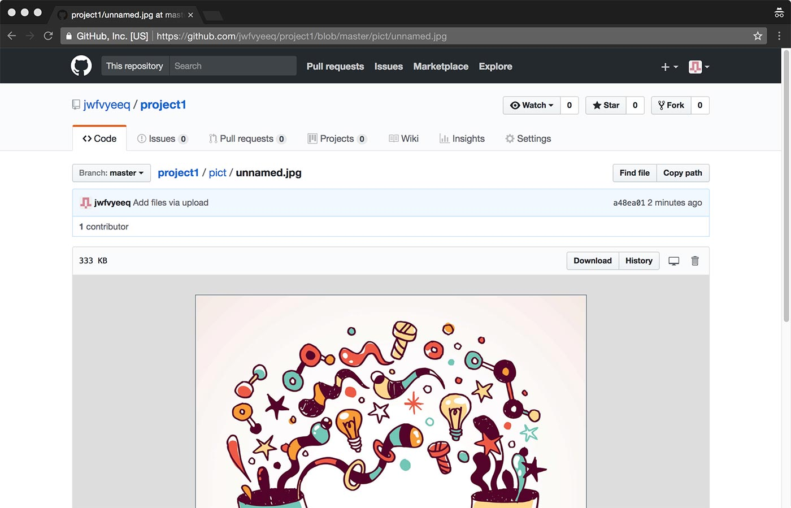

Github can overcome the problem of having 

To use Github you need to make an account which is free for our purpose:

Continue with the default setting in the following steps:

Then, you can start a project:

Don't forget to confirm your email in order to proceed: 

Now it's time to create your first repository which is a place where you can put files that will eventually become public. You can create as many as you want public repositories. Let's create the first one related to your first project. **Don't forget to CHECK the** `Initilize this repository with a README` before to press `Create repository`:

Now we need to change a setting to let Github to serve our files. Click the `Settings` tab:

Scroll down a bit untile the section `Github Pages` and select the dropdown item `master branch` and save it:

You shoud see something similar. Now your repository will put all yours files in a public space. You'll reach those files using as a base URL the one outlined below (in this case: https://jwfvyeeq.github.io/project1/):

Get back to the initial page clicking the `Code` tab:

From that page you can drag and drop files of folder to upload them on your repository:

You need to confirm the upload by pressing the `Commit changes` button:

Now in the `Code` section you should see the uploaded file/folder:

Now, you need to take care about how to build the URL for each resource. First, take note about the base URL. You'll need it to build the full URL for every image/video:

The base URL need to be couple with the relative path of each single resourse, i.e. `https://jwfvyeeq.github.io/project1/` and `pict/unnamed.jpg` resulting with the full URL `https://jwfvyeeq.github.io/project1/pict/unnamed.jpg`.

Every resource can be previewed using the file system navigator of Github:

And here an example about how to display an image hosted on Github within Codepen:

